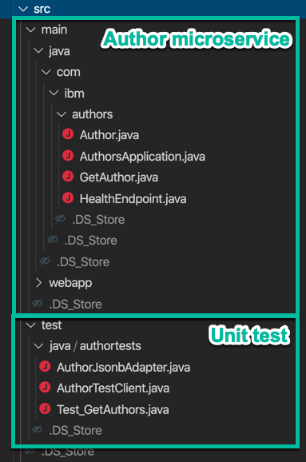

**!!! UNDER CONSTRUCTION !!!**

# Write and execute a JUnit test for a Java microservice based on MircoProfile running at the OpenLiberty server in the development mode

The project does only contain technical basics: how to technically develop a [JUnit](https://junit.org/junit5/) test for the Authors microservice of the [Cloud Native Starter](https://github.com/IBM/cloud-native-starter) example and run it directly in the [OpenLiberty server in the development mode](https://openliberty.io/blog/2019/10/22/liberty-dev-mode.html). It isn't intended to be a blueprint, how to write JUnit tests or to definition test organization, test strategie and so on, it is just to get technically started with one concrete example. 

You can also visit the [OpenLiberty tutorial "MicroProfile or Jakarta EE application"](https://openliberty.io/guides/microshed-testing.html#bootstrapping-your-application-for-testing) to start with.

The Authors microservice has one RESTful api endpoint called `getAuthor`. The endpoint provides one parameter for the Author name. The endpoint returns Author data in a JSON format.

These are the steps we need to basicly to understand and to realize:

1. We need a REST Client to invoke the REST endpoint of the Authors microservice.
2. Then we need to transform the JSON response of the REST endpoint to a Author data class. 
3. We need to handle different values to invoke the REST Endpoint parameter for the Author name, to run tests with a variations of name. 
4. Then we need to compare the actual response value with a expected value and document the result.

**To create the JUnit test, we need to know**

1. How to setup a JUnit test on the OpenLiberty for the development mode?
2. How to convert JSON Data from a String to a Author Java instance with JSON-B?
3. How to create a REST Client with JAX-RS and MicroProfile?
4. How to configure parameterized a JUnit test?
5. How to define write the concrete parameterized a JUnit test? 
6. How to execute the JUnit test?
7. How to find results test results ?

**Tools and frameworks**

That are the Tools and frameworks I use in my example project:

* IDE: [Visual Studio Code](https://code.visualstudio.com/)
* Server: [Open Liberty](https://openliberty.io/)
* Framework: [Eclipse MicroProfile](https://projects.eclipse.org/projects/technology.microprofile)
* Java project organization: [Apache Maven](https://maven.apache.org/)

---

# 1. How to setup a JUnit test on the OpenLiberty for the development mode?

To setup JUnit tests and run with the OpenLiberty server in the development mode, we have to provide a `test` folder in the `src` folder of our Java project. The image below shows the folders of my example project.



These are the classes in the image above:

**`com.ibm.authors` Package for Authors microservice**

* `AuthorsApplication` class repesents the JAX-RS RESTful web application.
* `Author` class repesents the data structure we use for the Author.
* `GetAuthor` class repesents the REST API Endpoint.
* `HealthEndpoint` class repesents the support readiness probes for Kubernetes.

**`authortests` Package for the JUnit test of the Authors microservice**

* `AuthorJsonbAdapter` class repesents JSON-B adapter for a JSON-B mapping configuration.
* `AuthorTestClient` class repesents the REST Client of the Authors microservice.
* `Test_GetAuthors` class repesents the JUnit test which will be executed as the  parameterized test run.

## 1.2 The Java project configuration for the JUnit test using Maven

* Dependencies

In the `pom.xml` file you need to add the JUnit depencencies.
The `junit-jupiter-api` and the `junit-jupiter-engine` are the basics for the Unit tests. With the `junit-jupiter-params` depencency we can define later a parameterized test. 

Here are the needed depencencies for JUnit in the `pom.xml`.

```xml
	<!-- JUnit Test --> 
	<dependency>
		<groupId>org.junit.jupiter</groupId>
		<artifactId>junit-jupiter-api</artifactId>
		<version>5.6.0</version>
		<scope>test</scope>
	</dependency>
	<dependency>
		<groupId>org.junit.jupiter</groupId>
		<artifactId>junit-jupiter-engine</artifactId>
		<version>5.6.0</version>
		<scope>test</scope>
	</dependency>
	<dependency>
		<groupId>org.junit.jupiter</groupId>
		<artifactId>junit-jupiter-params</artifactId>
		<version>5.6.0</version>
		<scope>test</scope>
	</dependency>
	<!-- JUnit Test -->
```

* Maven build plugins

Here we need following plugins in the build section of the maven file:

*  [maven-surefire-plugin](https://maven.apache.org/surefire/maven-surefire-plugin/usage.html) 
* [maven-failsafe-plugin](https://maven.apache.org/surefire/maven-failsafe-plugin/usage.html). 

```xml
    <!-- JUNIT  -->
	<plugin>
		<artifactId>maven-surefire-plugin</artifactId>
		<version>2.22.2</version>
	</plugin>
	<plugin>
		<artifactId>maven-failsafe-plugin</artifactId>
		<version>2.22.2</version>
	</plugin>
	<!-- JUNIT -->
```

We use the [liberty-maven-plugin](https://github.com/OpenLiberty/ci.maven) for the  OpenLiberty server.

```xml
    <!-- Enable liberty-maven plugin -->
    <plugin>
        <groupId>io.openliberty.tools</groupId>
        <artifactId>liberty-maven-plugin</artifactId>
		<version>3.1</version>
		<!-- libertyMavenConfiguration -->
		<configuration>
            <serverName>authorsDevJUnitServer</serverName>
			<configFile>liberty/server.xml</configFile>
        </configuration>
	    <!-- libertyMavenConfiguration -->
    </plugin>
    <!-- Enable liberty-maven-plugin -->
```

---

# 2. How to convert JSON Data from a String to a Author Java instance with JSON-B?

When we get the result of the response of our endpoint `getAuthor` the result is a text in a JSON format, but we want use data in an instance of a Author class.

In JSON-B we define a [JsonbAdapter](https://www.eclipsecon.org/na2016/sites/default/files/slides/JSONB%20-%20EclipseCon%202016.pdf) to define how the conversion from JSON to a class instance works. Therefor we `@Override the operations `adaptToJson` and `adaptFromJson`.

The operation`adaptFromJson` defines how to create a Author object from a JSON Object.

```java
// Author data class
import com.ibm.authors.Author;

// JSON-binding
import javax.json.bind.adapter.JsonbAdapter;
import javax.json.JsonObject;
import javax.json.Json;

public class AuthorJsonbAdapter implements JsonbAdapter<Author, JsonObject> {
 
    ...

    @Override
    public Author adaptFromJson(final JsonObject jsonObject) throws Exception {
        final Author author = new Author();
        author.setBlog(jsonObject.getString("blog"));
        author.setName(jsonObject.getString("name"));
        author.setTwitter(jsonObject.getString("twitter"));
        return author;
    }
}
```
As you see in the following code from the class `Test_GetAuthors.java`.
Based on the `AuthorJsonbAdapter` a new JSON-B configuration is created. That configuration is utilized to create a JSON-B object. That JSON-B object contains the implemented operation `fromJson` and knows how to create a instance of a Author class. 

```java
    final JsonbConfig config = new JsonbConfig().withAdapters(new AuthorJsonbAdapter());
    final Jsonb jsonb = JsonbBuilder.create(config);    
    final Author author_json = jsonb.fromJson(response, Author.class);
```

## The Java project configuration for the JSON-B using maven

Here we add:

* One reference implementation from [GlassFish](https://en.wikipedia.org/wiki/GlassFish) for JSON
* [The yasson reference implementation of JSON binding](https://projects.eclipse.org/projects/ee4j.yasson)

```xml
	<!-- JSONB --> 
	<dependency>
		<groupId>org.eclipse</groupId>
		<artifactId>yasson</artifactId>
		<version>1.0</version>			<scope>test</scope>
	</dependency>
	<dependency>
		<groupId>org.glassfish</groupId>
		<artifactId>javax.json</artifactId>
		<version>1.1</version>
		<scope>test</scope>
	</dependency>		
	<!-- JSONB -->
```

---

# 3. How to create a REST Client with JAX-RS and MicroProfile?

In the following code you see the interface class `AuthorTestClient`.
That class contains the REST Client interface definition for the REST Endpoint of the Authors microservice. With the usage of MicroProfile annotation `@RegisterRestClient` a RESTful Client will be created, when we use the that interface to implement the JUnit test.

I define the expected return value of `getAuthors` response as a `String`. 

As you see, there is only one annotation of MicroProfile `@RegisterRestClient` and remaing annotations are from JAX-RS.

```java
import javax.ws.rs.Path;
import javax.ws.rs.GET;
import javax.ws.rs.Produces;
import javax.ws.rs.core.MediaType;
import javax.ws.rs.QueryParam;
import org.eclipse.microprofile.rest.client.inject.RegisterRestClient;

@Path("/getauthor")
@RegisterRestClient
public interface AuthorTestClient {

    @GET
    @Produces(MediaType.APPLICATION_JSON)
    public String getAuthor(@QueryParam("name") String name);
}
```

## 4. How to configure parameterized a JUnit test?

The class `Test_GetAuthors` implements the JUnit test. With the annotation  


---

# Additional resources

## MicroProfile RestClient

* [Tomitribe (Blog post)](https://www.tomitribe.com/blog/overview-of-microprofile-rest-client/)

## JUnit

Configure OpenLiberty:

* [Setup Unit Tests in OpenLiberty](https://github.com/OpenLiberty/open-liberty/wiki/Unit-Tests)

* [Dependencies in JUnit](https://junit.org/junit5/docs/5.1.0-M1/user-guide/#dependency-diagram)

Useful blog posts:

* [Adam-Bien (Blog post)](http://www.adam-bien.com/roller/abien/entry/using_microprofile_rest_client_for)

* [Petri Kainulainen (Blog post)](https://www.petrikainulainen.net/programming/testing/junit-5-tutorial-writing-parameterized-tests/)

* [Sebastian Daschner (YouTube)](https://www.youtube.com/watch?v=JPctzdfxeXo)

* [JUnit user-guide running tests is vscode](https://junit.org/junit5/docs/current/user-guide/#running-tests-ide-vscode)

## Jsonb

* [RIECKPIL](https://rieckpil.de/whatis-json-binding-json-b/)

* [3 ways to convert String to JSON object in Java?](https://www.java67.com/2016/10/3-ways-to-convert-string-to-json-object-in-java.html)