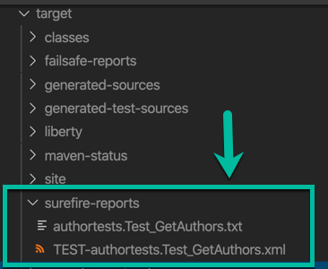

**!!! UNDER CONSTRUCTION !!!**

# Write and execute a JUnit test for a Java microservice based on MircoProfile running at the OpenLiberty server in the development mode

The project does only contain technical basics: how to technically develop a [JUnit](https://junit.org/junit5/) test for the Authors microservice of the [Cloud Native Starter](https://github.com/IBM/cloud-native-starter) example and run it directly in the [OpenLiberty server in the development mode](https://openliberty.io/blog/2019/10/22/liberty-dev-mode.html). 

It isn't intended to be a blueprint, or a how to guide for writing JUnit tests or how to definition test organization, test strategie and so on, it is just to get technically started with one concrete microservice example for the Cloud Native Starter project. 

You can also visit the [OpenLiberty tutorial "MicroProfile or Jakarta EE application"](https://openliberty.io/guides/microshed-testing.html#bootstrapping-your-application-for-testing) to start with.

The Authors microservice has one RESTful api endpoint called `getAuthor`. The endpoint provides one parameter for the Author name. The endpoint returns Author data in a JSON format.

These are the steps we need to basically to understand and to realize:

1. We need a REST Client to invoke the REST endpoint of the Authors microservice.
2. Then we need to transform the JSON response of the REST endpoint to an Author data class. 
3. We need to handle different values to invoke the REST Endpoint parameter for the Author name to run tests with a variations of name. 
4. Then we need to compare the actual response value with an expected value and document the result.

Here is a example of the test execution:


**To create the JUnit test, we need to know**

1. How to setup a JUnit test on the OpenLiberty for the development mode?
2. How to convert JSON Data from a String to a Author Java instance with JSON-B?
3. How to create a REST Client with JAX-RS and MicroProfile?
4. How to configure parameterized a JUnit test?
5. How to define write the concrete parameterized JUnit test? 
6. How to execute the JUnit test?
7. How to find results test results?

**Tools and frameworks**

That are the Tools and frameworks I use in my example project:

* IDE: [Visual Studio Code](https://code.visualstudio.com/)
* Server: [Open Liberty](https://openliberty.io/)
* Framework: [Eclipse MicroProfile](https://projects.eclipse.org/projects/technology.microprofile)
* Java project organization: [Apache Maven](https://maven.apache.org/)

---

# 1. How to setup a JUnit test on the OpenLiberty for the development mode?

To setup JUnit tests and run with the OpenLiberty server in the development mode, we have to provide a `test` folder in the `src` folder of our Java project. The image below shows the folders of my example project.


These are the classes in the image above:

**`com.ibm.authors` Package for Authors microservice**

* `AuthorsApplication` class represents the JAX-RS RESTful web application.
* `Author` class represents the data structure we use for the Author.
* `GetAuthor` class represents the REST API Endpoint.
* `HealthEndpoint` class represents the support readiness probes for Kubernetes.

**`authortests` Package for the JUnit test of the Authors microservice**

* `AuthorJsonbAdapter` class represents JSON-B adapter for a JSON-B mapping configuration.
* `AuthorTestClient` class represents the REST Client of the Authors microservice.
* `Test_GetAuthors` class represents the JUnit test which will be executed as the  parameterized test run.

## 1.2 The Java project configuration for the JUnit test using Maven

* Dependencies

In the `pom.xml` file you need to add the JUnit dependencies.

The `junit-jupiter-api` and the `junit-jupiter-engine` are the basics for the Unit tests. With the `junit-jupiter-params` depencency we can define later a parameterized test. 

Here are the needed dependencies for JUnit in the `pom.xml`.

```xml
	<!-- JUnit Test --> 
	<dependency>
		<groupId>org.junit.jupiter</groupId>
		<artifactId>junit-jupiter-api</artifactId>
		<version>5.6.0</version>
		<scope>test</scope>
	</dependency>
	<dependency>
		<groupId>org.junit.jupiter</groupId>
		<artifactId>junit-jupiter-engine</artifactId>
		<version>5.6.0</version>
		<scope>test</scope>
	</dependency>
	<dependency>
		<groupId>org.junit.jupiter</groupId>
		<artifactId>junit-jupiter-params</artifactId>
		<version>5.6.0</version>
		<scope>test</scope>
	</dependency>
	<!-- JUnit Test -->
```

* Build plugins

	*  [maven-surefire-plugin](https://maven.apache.org/surefire/maven-surefire-plugin/usage.html) 
	* [maven-failsafe-plugin](https://maven.apache.org/surefire/maven-failsafe-plugin/usage.html). 

```xml
    <!-- JUNIT  -->
	<plugin>
		<artifactId>maven-surefire-plugin</artifactId>
		<version>2.22.2</version>
	</plugin>
	<plugin>
		<artifactId>maven-failsafe-plugin</artifactId>
		<version>2.22.2</version>
	</plugin>
	<!-- JUNIT -->
```

We use the [liberty-maven-plugin](https://github.com/OpenLiberty/ci.maven) for the  OpenLiberty server.

```xml
    <!-- Enable liberty-maven plugin -->
    <plugin>
        <groupId>io.openliberty.tools</groupId>
        <artifactId>liberty-maven-plugin</artifactId>
		<version>3.1</version>
		<!-- libertyMavenConfiguration -->
		<configuration>
            <serverName>authorsDevJUnitServer</serverName>
			<configFile>liberty/server.xml</configFile>
        </configuration>
	    <!-- libertyMavenConfiguration -->
    </plugin>
    <!-- Enable liberty-maven-plugin -->
```

---

# 2. How to convert JSON Data from a String to a Author Java instance with JSON-B?

When we get the result of the response of our endpoint `getAuthor` the result is a text in a JSON format, but we want use data in an instance of a Author class.

In JSON-B we define a [JsonbAdapter](https://www.eclipsecon.org/na2016/sites/default/files/slides/JSONB%20-%20EclipseCon%202016.pdf) to define how the conversion from JSON to a class instance works. Therefor we `@Override the operations `adaptToJson` and `adaptFromJson`.

The operation`adaptFromJson` defines how to create a Author object from a JSON Object.

```java
// Author data class
import com.ibm.authors.Author;

// JSON-binding
import javax.json.bind.adapter.JsonbAdapter;
import javax.json.JsonObject;
import javax.json.Json;

public class AuthorJsonbAdapter implements JsonbAdapter<Author, JsonObject> {
 
    ...

    @Override
    public Author adaptFromJson(final JsonObject jsonObject) throws Exception {
        final Author author = new Author();
        author.setBlog(jsonObject.getString("blog"));
        author.setName(jsonObject.getString("name"));
        author.setTwitter(jsonObject.getString("twitter"));
        return author;
    }
}
```

The following code from the class `Test_GetAuthors.java` you see how to utilize the `AuthorJsonbAdapter` to create a new JSON-B configuration. That configuration is used to create a JSON-B object. That JSON-B object contains the implemented operation `fromJson` and knows how to create a instance of a Author class. 

```java
    final JsonbConfig config = new JsonbConfig().withAdapters(new AuthorJsonbAdapter());
    final Jsonb jsonb = JsonbBuilder.create(config);    
    final Author author_json = jsonb.fromJson(response, Author.class);
```

## The Java project configuration for the JSON-B using maven

We need to add following dependencies in the pom.xml.

* One reference implementation from [GlassFish](https://en.wikipedia.org/wiki/GlassFish) for JSON
* [The yasson reference implementation of JSON binding](https://projects.eclipse.org/projects/ee4j.yasson)

```xml
	<!-- JSONB --> 
	<dependency>
		<groupId>org.eclipse</groupId>
		<artifactId>yasson</artifactId>
		<version>1.0</version>			<scope>test</scope>
	</dependency>
	<dependency>
		<groupId>org.glassfish</groupId>
		<artifactId>javax.json</artifactId>
		<version>1.1</version>
		<scope>test</scope>
	</dependency>		
	<!-- JSONB -->
```

---

# 3. How to create a REST Client with JAX-RS and MicroProfile?

The following code shows the interface class `AuthorTestClient`.
That class contains the REST Client interface definition for the REST Endpoint of the Authors microservice. With the usage of MicroProfile annotation `@RegisterRestClient` a RESTful Client will be created, when the interface is used in the JUnit test.

The expected return value of `getAuthors` response is defined as a `String`. 

As you see, there is only one annotation of MicroProfile `@RegisterRestClient` utilized and the remaing annotations are from JAX-RS.

```java
import javax.ws.rs.Path;
import javax.ws.rs.GET;
import javax.ws.rs.Produces;
import javax.ws.rs.core.MediaType;
import javax.ws.rs.QueryParam;
import org.eclipse.microprofile.rest.client.inject.RegisterRestClient;

@Path("/getauthor")
@RegisterRestClient
public interface AuthorTestClient {

    @GET
    @Produces(MediaType.APPLICATION_JSON)
    public String getAuthor(@QueryParam("name") String name);
}
```

# 4. How to configure the parameterized a JUnit test?

The class `Test_GetAuthors` implements the JUnit test with the operation `testGetAuthor`.

The test is defined as a `ParameterizedTest` and can be repeated with given values from a `CsvSource`.

The annotation `@ParameterizedTest` and the value for `name`, the count of the parameters is configured. That test has two parameters.

```java
    @ParameterizedTest(name = "{index} => name=''{0},{1}''")
```

For more details see in the [JUnit documentation](https://junit.org/junit5/docs/5.0.1/api/org/junit/jupiter/params/ParameterizedTest.html) and can be repeated by using these input parameters.

The concrete test implementation itself happens in the operation `testGetAuthor`. The operation contains the names for the parameters defined before. These parameters we use in the test implementation.
 
```java
public void testGetAuthor(
			final String authorName, 
			final String expectedResult)
```

The annotation `@CsvSource` contains a comma seperated list of values which will for the test execution. 

For more details see in the [JUnit documentation](https://junit.org/junit5/docs/5.0.3/api/org/junit/jupiter/params/provider/CsvSource.html). 

The values are in order to fit to parameters `nameAuthor` and `expectedResult`.

```java
    @CsvSource({"Thomas,Thomas Suedbroecker",
                "Niklas,Niklas Heidloff",
                "Michael,Michael Heinrich"
              }) 
```

# 5. How to define write the concrete parameterized JUnit test? 


## Step 1: Create a REST Client

To invoke our REST Endpoint `getAuthor` of the Authors microservice we use the 
`RestClientBuilder` from MicroProfile to create our REST Client.

Here we use the defined Interface `AuthorTestClient.class` and the builder returns a object instance of the `AuthorTestClient`.

```java
final AuthorTestClient authorClient = RestClientBuilder.newBuilder().baseUri(baseURI).build(AuthorTestClient.class);
```

## Step 2: Invoke the REST Client

Now we invoke the REST Client and we use our test parameter `nameAuthor`as input.

```java
final String response = authorClient.getAuthor(nameAuthor);
```

## Step 3: Convert the response to a Author data object

_Note:_ Here we use JSON-B

```java
	final JsonbConfig config = new JsonbConfig().withAdapters(new AuthorJsonbAdapter());
	final Jsonb jsonb = JsonbBuilder.create(config);
	final Author author_json = fromJson(response, Author.class);
```

## Step 4: Compare the actual value of response with the expected value from the parameter

To compare the actual and expected value we use the assertEquals from JUnit.

```java
     assertEquals(expectedResult, author_json.getName());
```

If a the values aren't equal a`ssertEquals` throws a `AssertionFailedError` and document the error in `target/surefire-reports/TEST-authortests.Test_GetAuthors.txt`.

Here a example output:

```
org.opentest4j.AssertionFailedError: expected: <Michael Heinrich> but was: <Niklas Heidloff>
	at authortests.Test_GetAuthors.testGetAuthor(Test_GetAuthors.java:60)
```

For more details see in the [JUnit documentation](https://junit.org/junit4/javadoc/latest/org/junit/Assert.html)

# 6. How to execute the JUnit test?

With the usage of the [liberty-maven-plugin](https://github.com/OpenLiberty/ci.maven) we can simple start the OpenLiberty server with:

```sh
$ mvn liberty:dev
```

Then we cab just press return, as we see in the terminal.

```sh
$ [INFO] Press the Enter key to run tests on demand.
```

# 7. How to find results test results?

The test results are stored in the `target/surefire-reports/*` folder.



Run test a find the test results.


---

# Additional resources

## MicroProfile RestClient

* [Tomitribe (Blog post)](https://www.tomitribe.com/blog/overview-of-microprofile-rest-client/)

## JUnit

Configure OpenLiberty:

* [Setup Unit Tests in OpenLiberty](https://github.com/OpenLiberty/open-liberty/wiki/Unit-Tests)

* [Dependencies in JUnit](https://junit.org/junit5/docs/5.1.0-M1/user-guide/#dependency-diagram)

Useful blog posts:

* [Adam-Bien (Blog post)](http://www.adam-bien.com/roller/abien/entry/using_microprofile_rest_client_for)

* [Petri Kainulainen (Blog post)](https://www.petrikainulainen.net/programming/testing/junit-5-tutorial-writing-parameterized-tests/)

* [Sebastian Daschner (YouTube)](https://www.youtube.com/watch?v=JPctzdfxeXo)

* [JUnit user-guide running tests is vscode](https://junit.org/junit5/docs/current/user-guide/#running-tests-ide-vscode)

## Jsonb

* [RIECKPIL](https://rieckpil.de/whatis-json-binding-json-b/)

* [3 ways to convert String to JSON object in Java?](https://www.java67.com/2016/10/3-ways-to-convert-string-to-json-object-in-java.html)