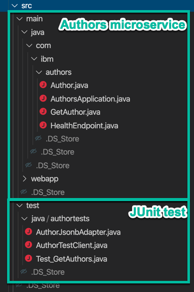

**!!! UNDER CONSTRUCTION !!!**

# JUnit Testing on OpenLiberty development server, running a microservice based on MircoProfile 

Technical basics for how to develop a JUnit for our Author microservice of the Cloud Native Starter example.

**Tools and frameworks**

* IDE: Visual Studio Code
* Server: Open Liberty
* Framework: MicroProfie
* Maven: Java project organization

**Need to know**

1. How to setup and run JUnit tests on the OpenLiberty development server?
2. How to create a REST Client with MicroProfile JAX-RS?
3. How to convert JSON Data from a String in a Java Class with MicroProfile JSON-B?
4. How to configure parameterized test in JUnit?
5. How to compare and report results in JUnit?

---

# How to setup and run JUnit tests on the OpenLiberty development server?

When you setup JUnit test to run directly on the same OpenLiberty server as the microservice application you have to provide a `test` folder in the `src` folder. The image below shows the folders of that project.



In the `pom.xml` file you need to add the JUnit depencencies.
The `junit-jupiter-api` and the `junit-jupiter-engine`are the basics. With the `junit-jupiter-params` depencency we can define later a parameterized test. 

```xml
	<!-- JUnit Test --> 
	<!-- https://mvnrepository.com/artifact/org.junit.jupiter/junit-jupiter-api -->
	<dependency>
		<groupId>org.junit.jupiter</groupId>
		<artifactId>junit-jupiter-api</artifactId>
		<version>5.6.0</version>
		<scope>test</scope>
	</dependency>
	<dependency>
		<groupId>org.junit.jupiter</groupId>
		<artifactId>junit-jupiter-engine</artifactId>
		<version>5.6.0</version>
		<scope>test</scope>
	</dependency>
	<!-- https://mvnrepository.com/artifact/org.junit.jupiter/junit-jupiter-params -->
	<dependency>
		<groupId>org.junit.jupiter</groupId>
		<artifactId>junit-jupiter-params</artifactId>
		<version>5.6.0</version>
		<scope>test</scope>
	</dependency>
	<!-- JUnit Test -->
```

---

# Additional resources

## MicroProfile RestClient

* [Tomitribe (Blog post)](https://www.tomitribe.com/blog/overview-of-microprofile-rest-client/)

## JUnit

Configure OpenLiberty:

* [Setup Unit Tests in OpenLiberty](https://github.com/OpenLiberty/open-liberty/wiki/Unit-Tests)

Useful blog posts:

* [Adam-Bien (Blog post)](http://www.adam-bien.com/roller/abien/entry/using_microprofile_rest_client_for)

* [Petri Kainulainen (Blog post)](https://www.petrikainulainen.net/programming/testing/junit-5-tutorial-writing-parameterized-tests/)

* [Sebastian Daschner (YouTube)](https://www.youtube.com/watch?v=JPctzdfxeXo)

## Jsonb

* [RIECKPIL](https://rieckpil.de/whatis-json-binding-json-b/)

* [3 ways to convert String to JSON object in Java?](https://www.java67.com/2016/10/3-ways-to-convert-string-to-json-object-in-java.html)