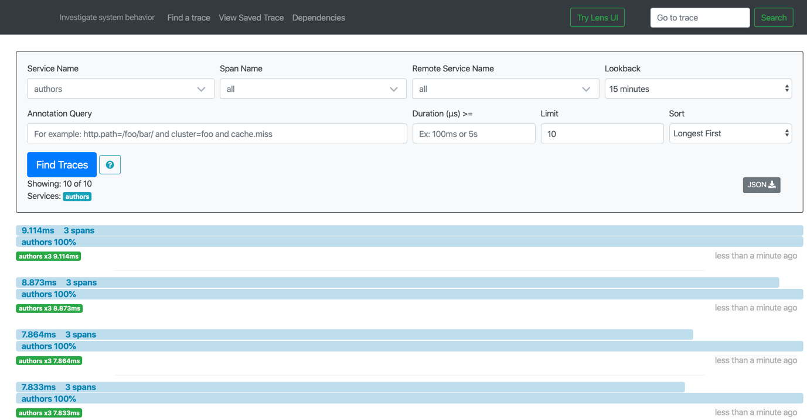

# Authors Microservice in Java

## Open tracing

Working with docker locally:

[Understand the Docker network](https://docs.docker.com/engine/reference/commandline/network_connect/)

* Step 1: Start the zipkin server
```sh
$ docker run --name zipkin -it -p 9411:9411 openzipkin/zipkin
```

* Step 2: Start the mircoservice and link the container to the zipkin container.

- build
```sh
$ docker build -t authors-opentracing .
```

 * run
```sh
$ docker run -i --rm --link zipkin:zipkinhost -p 3000:3000 authors-opentracing
```
or 

 * run with debug port 777
```sh
$ docker run -i --rm --link zipkin:zipkinhost -p 3000:3000 -p 7777:7777 authors-opentracing server debug
```
* Step 3: Now invoke the authors api `http://localhost:3000/openapi/ui/`


* Step 4: Open the url `http://localhost:9411/zipkin`

* Step 5: Press the button **Find Traces** and inspect the traces.



## Configuration

* Enable logging in your server.xml:

```xml
    <logging traceSpecification="com.ibm.ws.opentracing.*=all:com.ibm.ws.microprofile.opentracing.*=all"/>
```

* Full server.xml

```xml
<?xml version="1.0" encoding="UTF-8"?>
<server description="OpenLiberty Server">
	
    <featureManager>
        <feature>webProfile-8.0</feature>
        <feature>microProfile-2.1</feature>
        <!-- tag::zipkinUsr[] -->
        <feature>usr:opentracingZipkin-0.31</feature>
        <!-- end::zipkinUsr[] -->
    </featureManager>
     
    <opentracingZipkin host="zipkinhost" port="9411"/>

    <httpEndpoint id="defaultHttpEndpoint" host="0.0.0.0" httpPort="3000" httpsPort="9443"/>

    <webApplication location="authors.war" contextRoot="api">
        <!-- enable visibility to third party apis -->
        <classloader apiTypeVisibility="api,ibm-api,spec,stable,third-party"/>
    </webApplication>

    <logging traceSpecification="com.ibm.ws.opentracing.*=all:com.ibm.ws.microprofile.opentracing.*=all"/>
</server>
```

* Get get running container on your local machine

```sh
$ docker container list
$ IMAGE 				COMMAND 					CREATED 	   PORTS			NAMES
$ d69a8da6dd55	authors	"/opt/ol/helpers/run..."	32 seconds ago 9080/tcp, 9411/tcp, 0.0.0.0:3000->3000/tcp, 9443/tcp condescending_khayyam
$ 4fbd857042c8	openzipkin/zipkin	"/busybox/sh run.sh"	19 minutes ago 9410/tcp, 0.0.0.0:9411->9411/tcp	exciting_ellis
```

* Access the running Docker container in the terminal interactive mode

```sh
$ docker exec -it d69a8da6dd55 /bin/bash
```

* Liberty server on you Docker image

```sh
$ liberty/usr/servers/defaultServer
$ apps configDropins dropins server.env server.xml
```

* Find liberty logs on your running Docker container

```sh
$ ls 
$ config etc lib liberty logs mnt output root sbin sys usr dev	home lib64 lib.index.cache media ...
$ cd /logs
$ ls 
$ messages.log trace.log
```

* Copy trace logs, from your running Docker container to your local machine:

```sh
$ docker cp d69a8da6dd55:/logs/trace.log /Users/thoma
ssuedbroecker/Downloads
```


